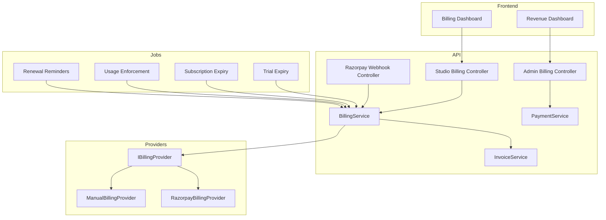

# Story-pix — Billing & Payments

Production-ready billing module with Razorpay integration, provider abstraction, subscription automation, invoices, and audit logging.

## Architecture



## Provider Abstraction (ADR-013 extended)

`IBillingProvider` supports:

- `createSubscription` / `cancelSubscription` / `changePlan`
- `createOrder` / `verifyPaymentSignature` / `verifyWebhookSignature`
- `getPublicKey`

Switch providers via `BILLING_PROVIDER`:

| Value | Provider | Use case |
|-------|----------|----------|
| `manual` (default) | `ManualBillingProvider` | Local dev, Super Admin plan assignment |
| `razorpay` | `RazorpayBillingProvider` | Production payments |

Future providers (Stripe, PayPal) implement the same interface without refactoring services.

## Data Models

### Payment (`payments`)

| Field | Type | Notes |
|-------|------|-------|
| studioId | ObjectId | Tenant scope |
| subscriptionId | ObjectId | Linked subscription |
| planId | ObjectId | Plan at checkout |
| razorpayOrderId | string | Razorpay order |
| razorpayPaymentId | string | Set on capture |
| razorpaySubscriptionId | string | Optional recurring ID |
| amount | number | Major currency units (INR) |
| currency | string | Default `INR` |
| paymentMethod | string | card, upi, etc. |
| status | enum | pending, paid, failed, refunded, cancelled |
| transactionDate | Date | Indexed |
| idempotencyKey | string | Webhook deduplication |

**Indexes:** `studioId`, `subscriptionId`, `status`, `transactionDate`

### Invoice (`invoices`)

| Field | Type | Notes |
|-------|------|-------|
| invoiceNumber | string | Unique, `INV-YYYYMM-00001` |
| amount | number | Subtotal |
| taxAmount | number | Reserved for GST/international taxes (0 for now) |
| totalAmount | number | amount + taxAmount |
| billingCycle | enum | monthly / yearly |
| status | enum | draft, issued, paid, overdue, cancelled |

Tax calculation is intentionally **not implemented** — schema supports future GST/international tax fields.

## API Reference

Base path: `/api/v1`

### Studio Billing (Studio Admin, `billing:read` / `billing:write`)

| Method | Path | Description |
|--------|------|-------------|
| GET | `/studio/billing/subscription` | Current subscription + usage |
| POST | `/studio/billing/upgrade` | Upgrade plan |
| POST | `/studio/billing/downgrade` | Downgrade plan |
| POST | `/studio/billing/cancel` | Cancel subscription |
| POST | `/studio/billing/payments/order` | Create Razorpay order |
| POST | `/studio/billing/payments/verify` | Verify payment signature |
| GET | `/studio/billing/payments` | Payment history |
| GET | `/studio/billing/invoices` | List invoices |
| GET | `/studio/billing/invoices/:id` | Invoice details |
| GET | `/studio/billing/invoices/:id/download` | Download HTML invoice |

### Admin Billing (Super Admin, `platform:*`)

| Method | Path | Description |
|--------|------|-------------|
| GET | `/admin/billing/revenue` | Revenue dashboard metrics |
| GET | `/admin/billing/payments` | All payments |
| GET | `/admin/billing/invoices` | All invoices |
| GET | `/admin/billing/subscriptions/history` | Subscription history |
| POST | `/admin/billing/payments/:id/refund` | Refund placeholder (audit logged) |

### Webhooks

| Method | Path | Auth |
|--------|------|------|
| POST | `/webhooks/razorpay` | `@Public()` + HMAC signature |

**Supported events:** `payment.captured`, `payment.failed`, `subscription.activated`, `subscription.charged`, `subscription.cancelled`

## Security

- **Webhook signature verification** — HMAC SHA256 with `RAZORPAY_WEBHOOK_SECRET`
- **Payment verification** — order_id + payment_id signature with key secret
- **Idempotency** — webhook events stored in `billing_webhook_events` with unique `eventId`
- **Audit logging** — all billing actions in `billing_audit_logs`

## Background Jobs

| Cron | Job | Action |
|------|-----|--------|
| 02:00 daily | Trial expiry | Remind + expire trials |
| 03:00 daily | Subscription expiry | Remind + expire/extend |
| 04:00 daily | Usage enforcement | Suspend over-limit studios |
| 09:00 daily | Renewal reminders | Re-run expiry reminders |

## Notifications

Events recorded via `AnalyticsIngestionService`:

- `trial_ending_soon`
- `payment_success`
- `payment_failed`
- `subscription_expiring`
- `subscription_renewed`

## Environment Variables

```env
BILLING_PROVIDER=manual          # or razorpay
BILLING_CURRENCY=INR
BILLING_TRIAL_REMINDER_DAYS=3
BILLING_RENEWAL_REMINDER_DAYS=7
RAZORPAY_KEY_ID=
RAZORPAY_KEY_SECRET=
RAZORPAY_WEBHOOK_SECRET=
```

## Frontend Pages

### Studio Admin

- `/studio/billing` — Billing Dashboard (subscription, checkout, payments, invoices)

### Super Admin

- `/admin/billing` — Revenue Dashboard
- `/admin/billing/payments` — Payments list
- `/admin/billing/invoices` — Invoices list
- `/admin/billing/subscriptions` — Subscription history

## Razorpay Checkout Flow

1. Studio selects plan → `POST /studio/billing/payments/order`
2. Frontend opens Razorpay checkout with `orderId` + `keyId`
3. On success → `POST /studio/billing/payments/verify` with signature
4. Backend activates subscription, creates invoice, emits `payment_success`
5. Webhook `payment.captured` provides redundant idempotent processing

## Manual Billing (Development)

With `BILLING_PROVIDER=manual`, checkout auto-verifies without Razorpay UI — useful for local testing.

## Testing

```bash
cd backend
npm test -- billing
```

Coverage includes payment orders, webhook signature handling, invoice generation, and payment serialization.
