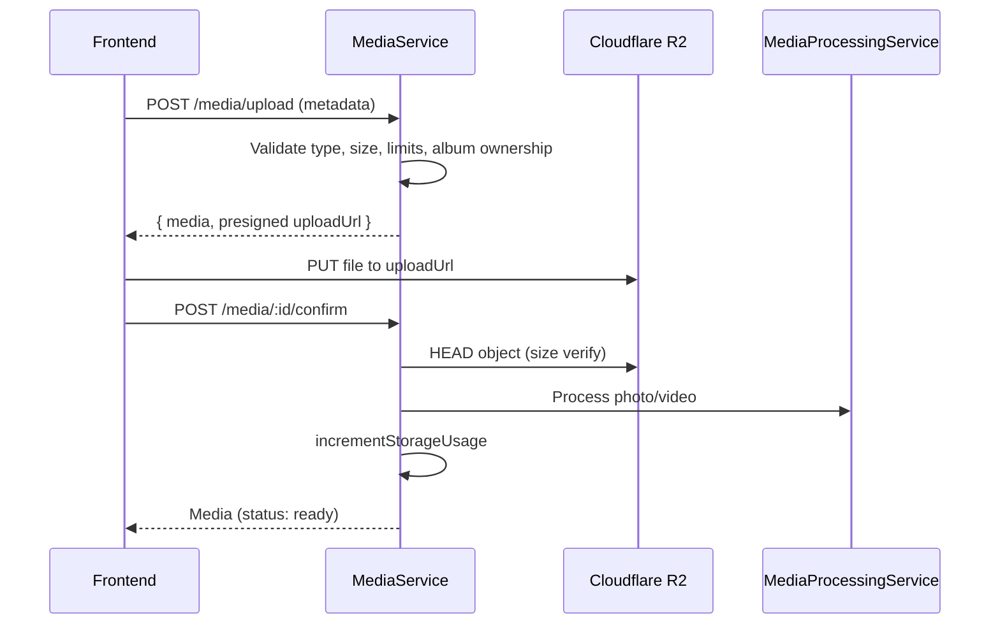

# Story-pix — Media Management

## Overview

Studios upload photos and videos scoped to an album. Files are stored in Cloudflare R2 via presigned URLs. Metadata lives in MongoDB for mapping, WebAR, viewer, and analytics layers to reference by `mediaId`.

## Media Schema (`media` collection)

| Field | Type | Notes |
|-------|------|-------|
| studioId | ObjectId | Tenant FK |
| albumId | ObjectId | Album FK |
| mediaType | enum | `photo`, `video` |
| fileName | string | Stored object name (UUID-based) |
| originalFileName | string | User's original filename |
| mimeType | string | Validated MIME |
| fileSize | number | Bytes |
| width / height / duration | number | Set after processing |
| r2ObjectKey | string | R2 object path |
| publicUrl | string | CDN/public URL |
| thumbnailUrl | string | Thumbnail URL (processing) |
| status | enum | uploading, processing, ready, failed, deleted |
| uploadedBy | ObjectId | User FK |
| deletedAt | Date | Soft delete |

### Indexes

- `studioId`, `albumId`, `mediaType`, `status`
- Compound: `{ studioId, albumId, deletedAt }`, `{ albumId, mediaType, status }`

## Upload Architecture



### R2 object key convention

```
tenants/{studioId}/albums/{albumId}/photos/{uuid}.jpg
tenants/{studioId}/albums/{albumId}/videos/{uuid}.mp4
tenants/{studioId}/albums/{albumId}/photos/thumbnails/{uuid}.jpg
```

## Storage Provider

`IStorageService` abstraction with auto-selection:

| Provider | When |
|----------|------|
| `MockStorageService` | R2 credentials not configured (dev) |
| `R2StorageService` | `R2_ACCESS_KEY_ID`, `R2_SECRET_ACCESS_KEY`, `R2_ENDPOINT` set |

### Environment variables

```
R2_BUCKET_NAME=Story-pix-dev
R2_ENDPOINT=https://<account>.r2.cloudflarestorage.com
R2_ACCESS_KEY_ID=...
R2_SECRET_ACCESS_KEY=...
STORAGE_PUBLIC_BASE_URL=https://media.Story-pix.app
MEDIA_MAX_PHOTO_SIZE_MB=25
MEDIA_MAX_VIDEO_SIZE_MB=500
```

## API Endpoints

Base: `/api/v1`

| Method | Path | Permission | Description |
|--------|------|------------|-------------|
| POST | `/media/upload` | `media:write` | Initiate upload, returns presigned URL |
| POST | `/media/:id/confirm` | `media:write` | Confirm upload, run processing |
| POST | `/media/:id/retry` | `media:write` | Retry failed upload |
| POST | `/media/:id/cancel` | `media:write` | Cancel pending upload |
| GET | `/media` | `media:read` | List media (filters) |
| GET | `/media/:id` | `media:read` | Media details |
| DELETE | `/media/:id` | `media:write` | Soft delete + R2 cleanup |
| GET | `/albums/:albumId/media` | `media:read` | Album-scoped media list |

## Request / Response Examples

### Initiate upload

```http
POST /api/v1/media/upload
Authorization: Bearer <token>
Content-Type: application/json

{
  "albumId": "507f1f77bcf86cd799439013",
  "mediaType": "photo",
  "originalFileName": "wedding-001.jpg",
  "mimeType": "image/jpeg",
  "fileSize": 2048576
}
```

```json
{
  "data": {
    "media": { "id": "...", "status": "uploading", "r2ObjectKey": "..." },
    "upload": {
      "uploadUrl": "https://...",
      "publicUrl": "https://media.Story-pix.app/...",
      "key": "...",
      "expiresIn": 900
    }
  }
}
```

### Confirm upload

```http
POST /api/v1/media/{id}/confirm
```

### Error: storage limit

```json
{
  "error": {
    "code": "PLAN_LIMIT_EXCEEDED",
    "message": "Storage limit exceeded for your current plan"
  }
}
```

## Subscription Enforcement

Before upload (`MediaLimitService`):

1. File type validation (photo: JPG/PNG/WEBP; video: MP4/MOV)
2. File size validation (configurable MB limits)
3. `checkStorageLimit(studioId, fileSizeGB)`
4. Per-album photo/video count vs plan limits

On confirm: `incrementStorageUsage(studioId, sizeGB)`  
On delete: `decrementStorageUsage(studioId, sizeGB)` + `deleteObject(r2ObjectKey)`

## Processing Architecture

`IMediaProcessor` / `MediaProcessingService` — in-process placeholder for worker-based sharp/ffmpeg processing.

| Media | Processing |
|-------|------------|
| Photo | Thumbnail key generation, dimensions (hints or defaults) |
| Video | Thumbnail key, duration, dimensions |

Future: queue job referencing `mediaId`; worker updates status to `ready`.

## Frontend

| Route | Page |
|-------|------|
| `/studio/albums/:id/media` | Album Media (upload + galleries) |

Components: `UploadArea`, `UploadProgressList`, `PhotoGallery`, `VideoGallery`, `MediaCard`, `FilePreviewModal`

Upload state: Zustand `upload.store.ts` for progress, retry, cancel.

## Folder Structure

```
backend/src/
  media/           schema, dto, services, controller
  storage/         IStorageService, Mock, R2

frontend/src/
  types/media.types.ts
  services/media.service.ts
  hooks/useMediaQueries.ts
  store/upload.store.ts
  features/media/components/
  pages/studio/AlbumMediaPage.tsx
```

## Future Extensions (no schema redesign)

- **Photo ↔ Video mapping** — mapping collection with `photoMediaId`, `videoMediaId`, `albumId`
- **WebAR** — target metadata on media document or child collection keyed by `mediaId`
- **Scan analytics** — events reference `mediaId`
- **Public viewer** — manifest lists media by `albumId` where `status=ready`
