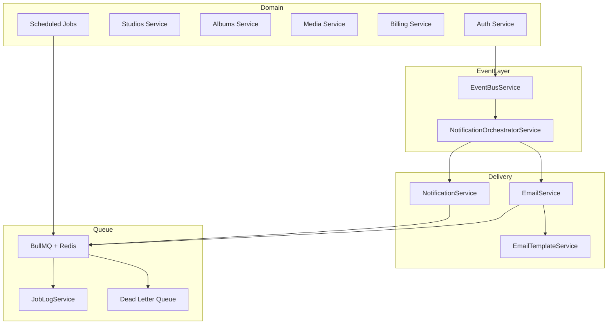

# Story-pix — Notifications, Email & Jobs

Event-driven notification architecture with BullMQ job processing, email provider abstraction, and in-app notification center.

## Architecture



## Layers

| Layer | Responsibility |
|-------|----------------|
| **Event** | `EventBusService` publishes typed `DomainEventType` payloads |
| **Notification** | Creates in-app records, orchestrates channels |
| **Email** | Template rendering + provider dispatch via queue |
| **Jobs** | BullMQ workers, retry policy, job logs, schedulers |

## Email Provider Abstraction

`IEmailProvider` with factory selection via `EMAIL_PROVIDER`:

| Provider | Env | Use case |
|----------|-----|----------|
| `console` (default) | — | Local dev; logs email content |
| `resend` | `RESEND_API_KEY` | Production email delivery |

Future: SendGrid, AWS SES, Postmark — implement `IEmailProvider` without changing services.

## MongoDB Collections

### `notifications`

Indexed by `studioId`, `userId`, `type`, `status`, `createdAt`.

Channels: `in_app`, `email`  
Status: `pending`, `sent`, `failed`, `read`

### `job_logs`

Tracks queue executions, retry attempts, failures, and dead-letter routing.

### `email_templates`

Versioned HTML + text templates with allowlisted `{{variables}}`.

## API Reference

### Studio (`notifications:read` / `notifications:write`)

| Method | Path | Description |
|--------|------|-------------|
| GET | `/notifications` | Paginated notification history |
| GET | `/notifications/unread` | Unread in-app notifications |
| PATCH | `/notifications/:id/read` | Mark notification read |

### Super Admin (`platform:*`)

| Method | Path | Description |
|--------|------|-------------|
| GET | `/admin/notifications` | Platform notification monitoring |
| GET | `/admin/jobs` | Job log history |
| GET | `/admin/jobs/failed` | Failed / dead-letter jobs |
| GET | `/admin/email-templates` | List templates |
| POST | `/admin/email-templates` | Create new template version |
| POST | `/admin/email-templates/preview` | Preview rendered template |

## Background Jobs

Scheduled via `@nestjs/schedule` → enqueued to BullMQ `Story-pix-scheduled`:

| Schedule | Job | Purpose |
|----------|-----|---------|
| Hourly | `payment-reconciliation` | Fail stale pending payments |
| Hourly | `analytics-aggregation` | Refresh analytics rollups |
| Daily 02:00 | `trial-expiry-check` | Trial reminders + expiry |
| Daily 03:00 | `subscription-expiry-check` | Renewal reminders + expiry |
| Daily 04:00 | `usage-limit-enforcement` | Suspend over-limit studios |
| Daily 04:00 | `storage-usage-sync` | Storage sync placeholder |
| Weekly | maintenance | Reserved |

Queue workers:

- `Story-pix-email` — send emails with retry + dead letter
- `Story-pix-notifications` — mark in-app notifications sent
- `Story-pix-dead-letter` — failed job archive

## Retry Policy

- Default attempts: `QUEUE_RETRY_ATTEMPTS` (3)
- Exponential backoff: `QUEUE_RETRY_DELAY_MS` (5000ms)
- Failures logged to `job_logs` with `dead_letter` status

## Redis / Inline Fallback

When `REDIS_URL` is unset, jobs run **inline** synchronously (dev-friendly). Set `REDIS_URL=redis://127.0.0.1:6379` for production BullMQ workers.

## Environment Variables

```env
REDIS_URL=
QUEUE_RETRY_ATTEMPTS=3
QUEUE_RETRY_DELAY_MS=5000
EMAIL_PROVIDER=console
EMAIL_FROM=noreply@Story-pix.app
EMAIL_FROM_NAME=Story-pix
RESEND_API_KEY=
```

## Frontend

| Route | Role | Page |
|-------|------|------|
| `/studio/notifications` | Studio Admin | Notification Center |
| `/admin/jobs` | Super Admin | Job Monitoring |
| `/admin/notifications` | Super Admin | Notification + Email Template Monitoring |

Header **notification bell** opens drawer with unread items (Studio Admin).

## Extensibility

Channel enum and orchestrator pattern support future channels without redesign:

- SMS
- WhatsApp
- Push notifications
- Mobile app push

Add a channel handler + queue worker; extend `NotificationOrchestratorService` dispatch map.

## Testing

```bash
cd backend
npm test -- notifications
```
